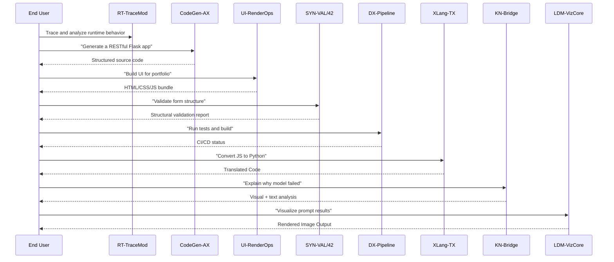
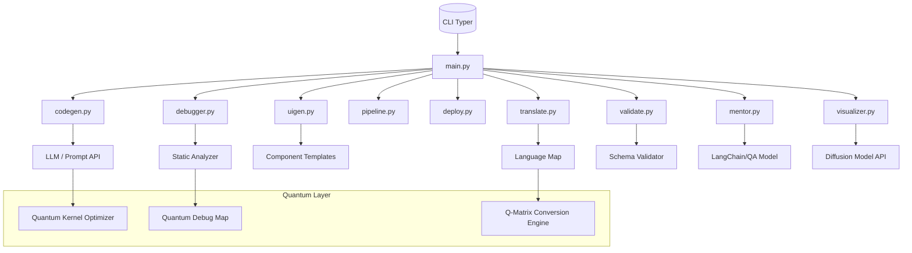
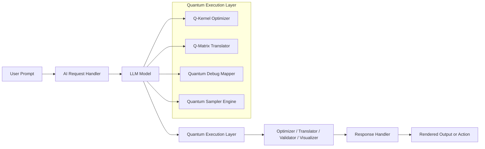

# Qwnt AI - Quantum-Enhanced AI Development Toolkit


**Qwnt AI** is an advanced AI-powered development ecosystem integrating intelligent automation, multi-model orchestration, and **quantum computing**. It radically simplifies how software is written, debugged, translated, deployed, and visualized. Developers and non-developers alike can interact with intuitive agents such as Debug AI, CodeGen, UI Generator, Validator, Deployment Engine, and Translator—all backed by a modular Python backend and extensible CLI.

At the core of Qwnt's performance edge is its **Quantum Execution Layer**, which accelerates critical AI workflows such as code optimization, matrix-based transformations, and multi-agent orchestration. This layer allows for non-linear scaling in processing, especially during validation and cross-language translation tasks.

---

## 🧱 Full Architecture Overview

### End-to-End Development Pipeline



### Python Backend Component Flow



### Quantum Stack Overlay



---

## ⚛️ Quantum Computing Integration

Qwnt AI leverages quantum-accelerated modules in these key areas:

- **Q-Kernel Optimizer**: Used in `CodeGen-AX` to enhance vectorized representations and token prediction efficiency.
- **Q-Matrix Translator**: Employed in `XLang-TX` for accurate and rapid translation across structurally distinct languages.
- **Quantum Debug Mapper**: Improves anomaly detection by computing error vectors in parallel using quantum-state transformations.
- **LDM-VizCore**: Utilizes quantum-driven generative sampling for producing highly creative and coherent visual outputs.

This fusion of classical and quantum AI enables Qwnt to operate at scale and precision beyond traditional systems.

---

## 🧠 Model Suite & Use Cases

| Model Name     | Use Case Description                                       |
| -------------- | ---------------------------------------------------------- |
| `RT-TraceMod`  | Real-time runtime inspection, performance trace analysis   |
| `CodeGen-AX`   | Generate code from natural language across 60+ languages   |
| `UI-RenderOps` | Build pixel-perfect, responsive websites with no coding    |
| `SYN-VAL/42`   | Syntax and schema validation for form data, APIs, and more |
| `DX-Pipeline`  | Test automation, CI/CD build, and deployment logic         |
| `XLang-TX`     | Bi-directional code translation between multiple languages |
| `KN-Bridge`    | Acts as a mentor AI—explains concepts, logic, and failures |
| `LDM-VizCore`  | Converts prompts into high-resolution visual renderings    |

---

## 🚀 CLI Command Examples

```bash
# Generate a Flask app scaffold
qwnt generate "A Flask app for personal budgeting"

# Debug Python files recursively
qwnt debug src/

# Build dark-themed UI with hero + pricing
qwnt uigen --theme dark --components hero,pricing

# Run validation on JSON schema
qwnt validate schema.json

# Run test suite and create build artifact
qwnt validate --ci

# Translate JavaScript logic to Python
qwnt translate --from js --to py script.js

# Learn why a model failed to train
qwnt mentor "Why did my model return NaN loss?"

# Generate an image prompt
qwnt visualize "futuristic city skyline at night"
```

---

## 🛠️ Module Breakdown

| Module          | Purpose                                                               |
| --------------- | --------------------------------------------------------------------- |
| `main.py`       | CLI entrypoint built with Typer                                       |
| `codegen.py`    | Handles prompt parsing, tokenization, and model invocation            |
| `debugger.py`   | Wraps linters and static analyzers (pylint, flake8, black)            |
| `uigen.py`      | Generates Tailwind/Bootstrap UI templates                             |
| `pipeline.py`   | Runs tests, type-checking, and CI/CD scripts                          |
| `deploy.py`     | Creates containers and pushes to Firebase, Vercel, etc.               |
| `translate.py`  | Maps code between supported languages                                 |
| `validate.py`   | JSON/YAML schema validation and interface checks                      |
| `mentor.py`     | Knowledge module that answers logic and debugging questions           |
| `visualizer.py` | Interfaces with image generation APIs (e.g., Stable Diffusion, DALLE) |

> Qwnt AI is architected to support **pluggable agent models** via a shared interface standard. New modules can be dropped in under `/src/agents` and registered via CLI extensions or model registry configs.

---

## 🧪 Getting Started

```bash
# Clone the repo
$ git clone https://github.com/QwntAI-Network/qwnt-ai.git && cd qwnt-ai

# Set up a virtual environment
$ python3 -m venv venv && source venv/bin/activate

# Install core dependencies
$ pip install -r requirements.txt

# Run the CLI
$ python -m src.main --help
```
